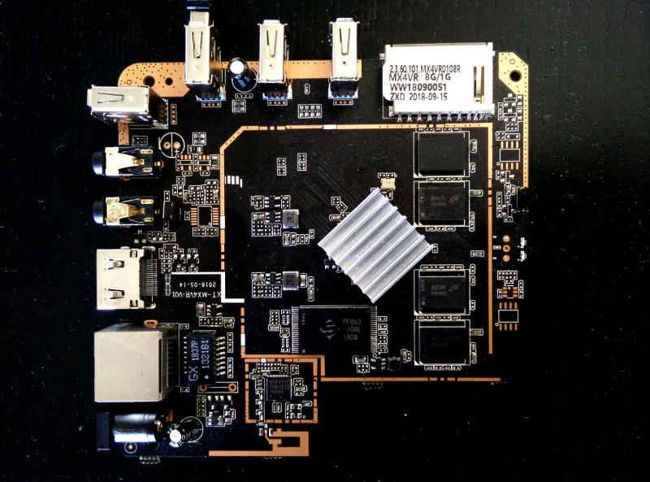
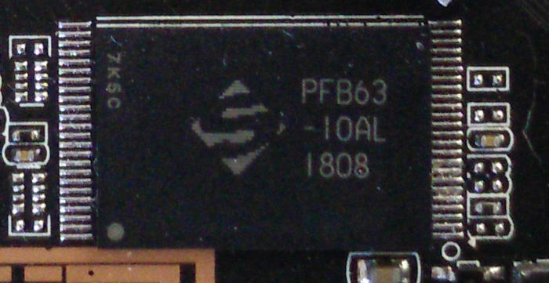
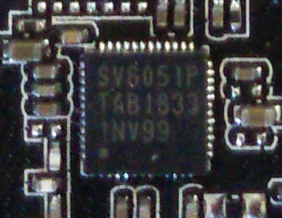
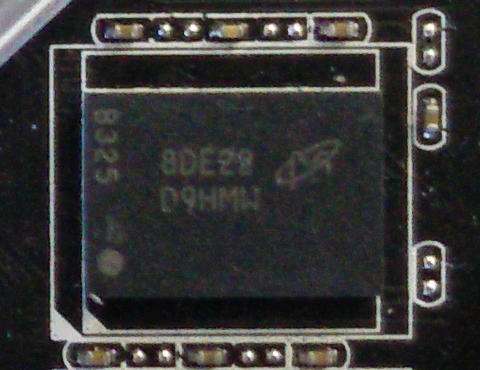

-=Title:Reverse engineering di un box android rockchip (Schishion V88 Plus)
### Reverse engineering di un box android rockchip (Schishion V88 Plus)

Qualche tempo fa acquistai un box android in grado di rendere smart il mio vecchio televisore. Purtroppo, considerando anche il costo irrisorio legato soprattutto all'assenza 
di un brand blasonato, e' risultato abbastanza inutilizzabile sia per quanto riguarda aggiornamenti del firmware (praticamente inesistenti) ma soprattutto per quel che 
riguarda il drm e le piattaforme di streaming piu' famose.  

A questo punto ho pensato ad un modo per renderlo nuovamente utilizzabile provando ad installare una distribuzione Linux.  
Questa tipologia di dispositivi contiene sostanzialmente una single board computer con preinstallato il sistema operativo Android.  

Il primo passo e' stato quello di aprire il case e ispezionare la board.  

Facendo un po' di ricerce con il nome visibile sul lettore schede SD (MX4VR) ho scoperto una versione del device chiamata __Schishion V88 Plus__ 
che adotta soc __Rockchip 3228B__.  

Questo e' un bene visto che la Rockchip fornisce un buon supporto sia a livello di [documentazione][2] che a livello di codice [opensource][1].  

Partendo dal soc, il Rockchip 3228B non sembra essere uno dei miglior processori realizzati dall'azienda, ma offre il supporto a livello hardware di diversi 
codec video. Inoltre,la scheda grafica supporta le OpenGLES 2.0.  

Approfondendo ulteriormente la vista della board, ho individuato il chip della memoria NAND  

il quale risulta essere (non vi sono molti riferimenti a riguardo o perlopiu' sono in lingua cinese) un chip Spektek da 8Gb memoria NAND.  

Stesso discorso per il modulo wifi. Dopo alcune ricerche non sono riuscito a ricavare molte informazioni, a parte il fatto che supporta il protocollo IEEE 802.11 b/g/n.  

Sulla ram invece mi sono arreso. Vi sono 8 di questi chip (4 sul fronte e 4 sul retro) e in base a quanto riportato sulle varie etichette(1Gb ram totali) deduco siano moduli 
da 256Mb (mi riservo di correggere l'articolo in seguito)  

_...da continuare_

[1]: https://github.com/rockchip-linux
[2]: http://opensource.rock-chips.com/wiki_Main_Page
